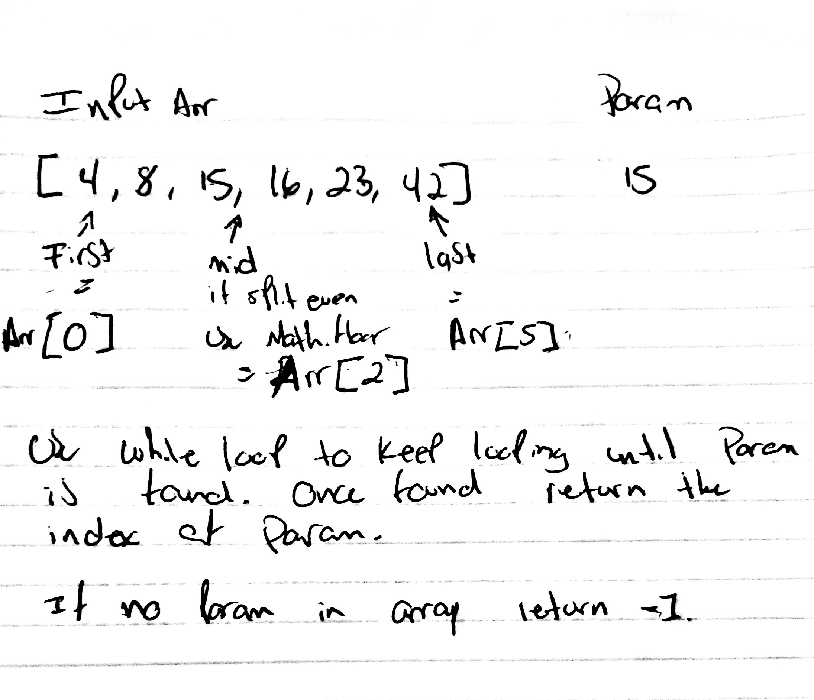

# Binary Search of Array
We will be doing a binary search of an element in the array given.
## Challenge
The challenge entails doing a binary search of an array without the use of any built-in methods.
## Approach & Efficiency
Setting a first, middle and last index from the array, using that information to loop through array until the middle value is the element provided and return the index of the element. If the element provided is not found in the array, we return -1. 
## Solution
