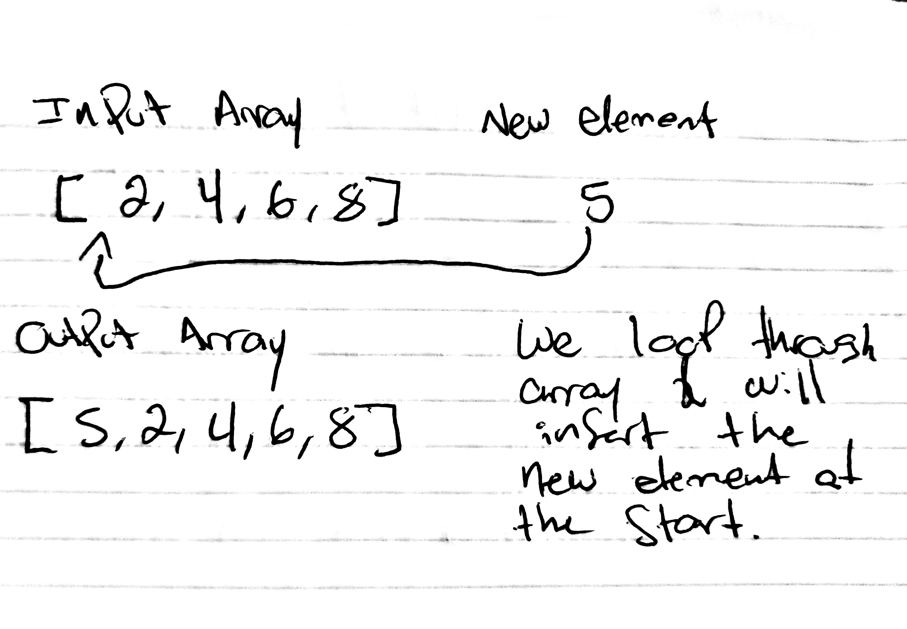

# Shift an Array
We will be shifting a new element into the start of a given array
## Challenge
The challenge entails inputting a new element at the start of an array without the use of any built-in methods.
## Approach & Efficiency
Switching the order of the elements in the array by moving the last index to a new index, keep doing that until done looping through the whole array, at the end we will add the new element as the first index of the array. 
## Solution
