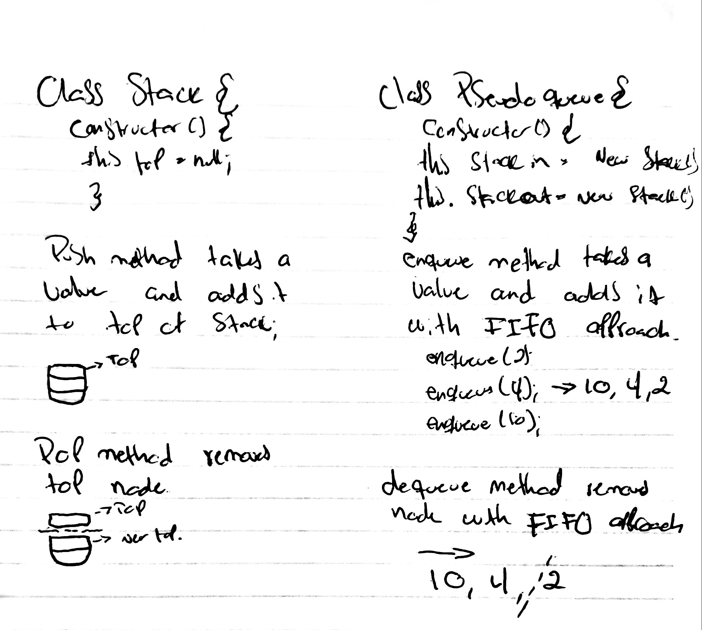

# Fifo Animal Shelter
We will be creating an animal shelter queue.
## Challenge
The challenge entails creating an AnimalShelter class which holds only dogs and cats.
## Approach & Efficiency
The shelter operates using a first-in, first-out approach. It implements enqueue(animal), which adds animal to the shelter. animal can be either a dog or a cat object, and dequeue(pref), which returns either a dog or a cat. If pref is not "dog" or "cat" then return null.
## Solution
