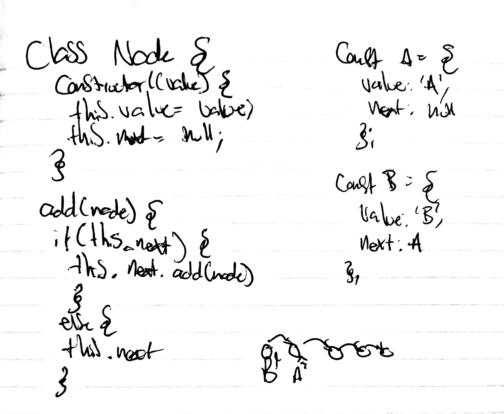

# Linked List
Create a linked list.
## Challenge
Create a Node class that has properties for the value stored in the Node, and a pointer to the next Node. Within your LinkedList class, include a head property. Upon instantiation, an empty Linked List should be created. At no time should an exception or stack trace be shown to the end user. Catch and handle any such exceptions and return a printed value or operation which cleanly represents the state and either stops execution cleanly, or provides the user with clear direction and output.
## Approach & Efficiency

## Solution
