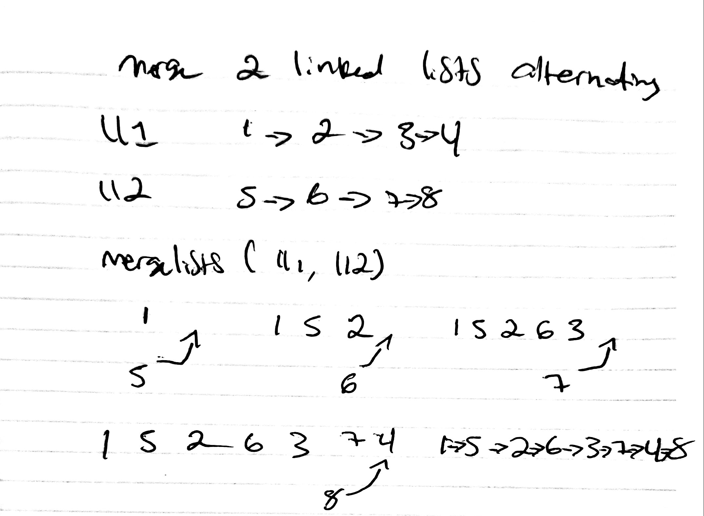

## Linked List Merge

We will be merging two linked lists.
## Challenge

The challenge takes two linked lists as arguments. Zip the two linked lists together into one so that the nodes alternate between the two lists and return a reference to the head of the zipped list.
## Approach & Efficiency

Create the two linked lists and loop through while rearranging their positions until done with both.
## Solution
