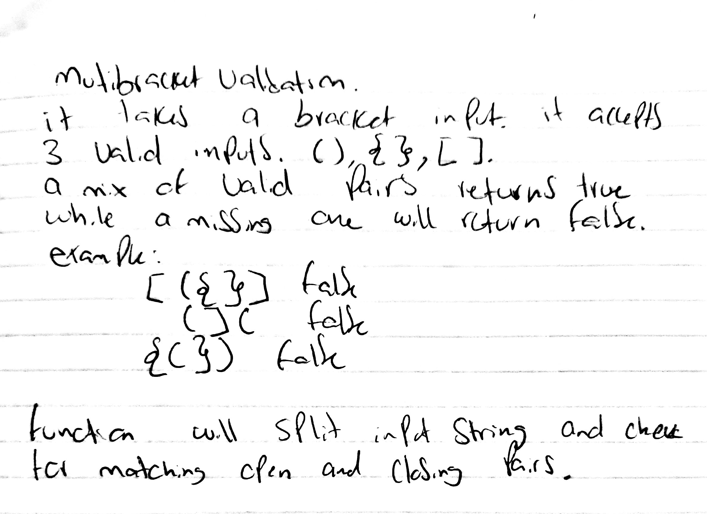

# Multi Bracket Validation
We will be creating a multi-bracket validation
## Challenge
The challenge entails creating a multibracket validation function that returns a boolean.
## Approach & Efficiency
fThe function takes a string as its only argument, splits it, compares to see if there are matching opening and closing brackets and will return a boolean representing whether or not the brackets in the string are balanced. There are 3 types of brackets:
Round Brackets : ()
Square Brackets : []
Curly Brackets : {}
## Solution
