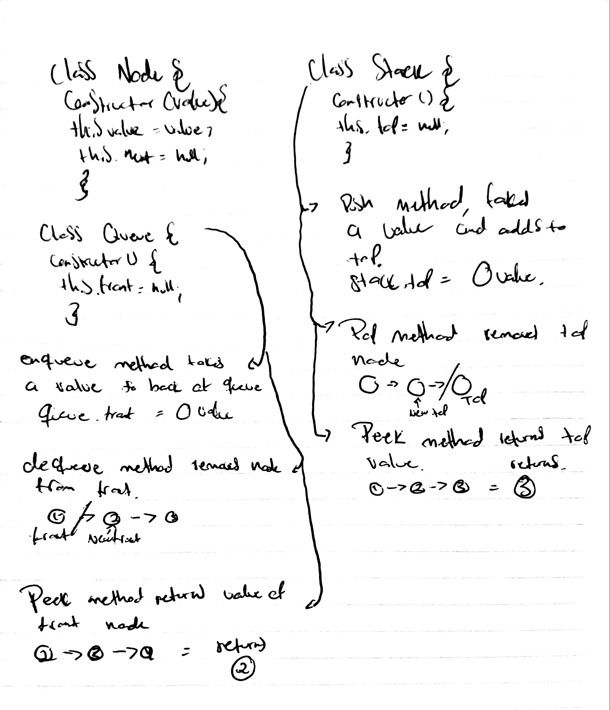

# Queue with Stacks
We will be creating a queue with stacks.
## Challenge
The challenge entails creating a brand new PseudoQueue class.
## Approach & Efficiency
Create a PseudoQueue class that will implement our standard queue interface, but will internally only utilize 2 Stack objects. It has two methods, enqueue(value) which inserts value into the PseudoQueue, using a first-in, first-out approach, and  dequeue() which extracts a value from the PseudoQueue, using a first-in, first-out approach. 
## Solution
