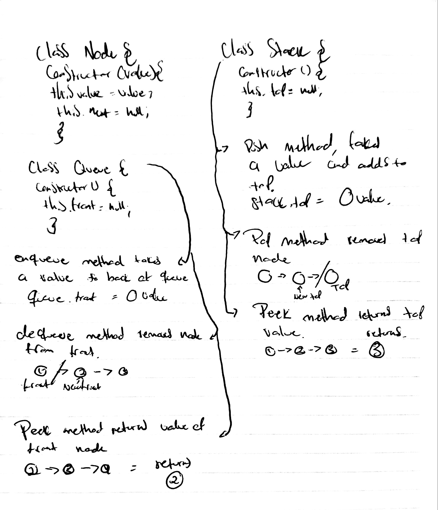

# Stack and Queue
We will be creating a stack and queue
## Challenge
The challenge entails creating a node, stack and queue class. The stack and queue class will have methods in them that will modify them.
## Approach & Efficiency
Create a Node class that has properties for the value stored in the Node, and a pointer to the next node. Create a Stack class that has a top property. It creates an empty Stack when instantiated and has a top value with null default. The stack will have a push method which takes any value as an argument and adds a new node with that value to the top of the stack. It has a method called pop that does not take any argument, removes the node from the top of the stack, and returns the node’s value, and a method called peek that does not take an argument and returns the value of the node located on top of the stack, without removing it from the stack. Create a Queue class that has a front property. It creates an empty Queue when instantiated and has a front value with a null default. The queue has a method called enqueue which takes any value as an argument and adds a new node with that value to the back of the queue. Another method called dequeue that does not take any argument, removes the node from the front of the queue, and returns the node’s value, and a method called peek that does not take an argument and returns the value of the node located in the front of the queue, without removing it from the queue.
## Solution
