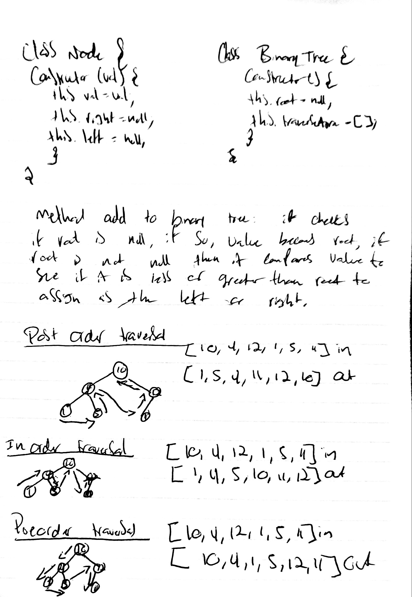

# Binary Tree and BST Implementation
We will be creating a binary tree
## Challenge
The challenge entails creating a node and binary tree class
## Approach & Efficiency
Node class has properties for the value stored in the node, the left child node, and the right child node. The BinaryTree class has methods for each of the depth first traversals called preOrder, inOrder, and postOrder which returns an array of the values, ordered appropriately.
## Solution
